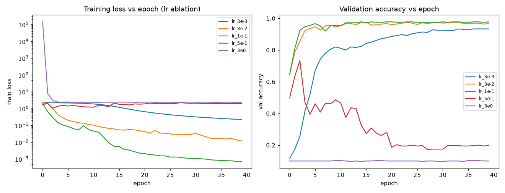
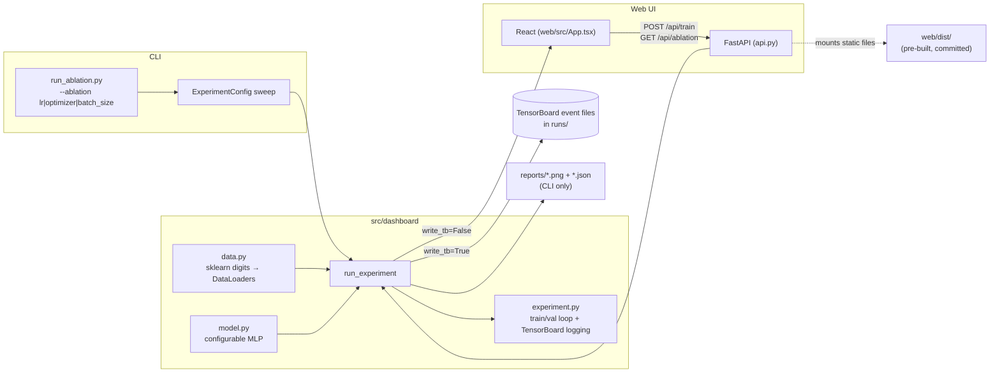

# Training Dashboard

Track a PyTorch training run properly, then prove it by watching one bad hyperparameter break it.


> AI Engineer Roadmap — Project 2.3. *Teaches: rigorous experimentation, reproducibility, reading
> loss curves. Done when you can look at a loss curve and diagnose the problem.*

## What it does

A small, configurable PyTorch MLP is wrapped in proper **experiment tracking** (TensorBoard) and a
controlled **ablation**: change exactly one thing — the learning rate — and chart the effect. The
result is a side-by-side set of loss curves that show every failure mode you need to recognize on
sight:

| Learning rate | Best val accuracy | Diagnosis |
| --- | ---: | --- |
| `3e-3` (too low) | 0.933 | Loss falls but **crawls**; still descending at epoch 40 → underfitting the budget. Fix: raise the LR or train longer. |
| `3e-2` | 0.975 | Smooth, healthy descent. |
| **`1e-1` (just right)** | **0.978** | **Fast, smooth** drop to train loss ≈ 0.0007 → well-tuned. |
| `5e-1` (too high) | 0.733 | Loss **oscillates and plateaus high** (~2.0) → steps overshoot the minimum. Fix: lower the LR. |
| `3e0` (far too high) | 0.103 ≈ random | Loss **diverges** / stays at chance (10 classes → 0.10) → training is broken. Fix: lower the LR by 10–100×. |



Given only the left-hand loss-curve plot, you should be able to name the problem (too low / good /
too high / diverged) and prescribe the fix without seeing the accuracy numbers — the too-high run
flatlining at the random-guess accuracy of 0.10 is the unmistakable signature of divergence.

An interactive web UI ships alongside the CLI tool: pick the optimizer, learning rate, and epochs,
hit **Train**, and watch the loss curve and validation accuracy draw live (the MLP trains in a
couple of seconds). **Run ablation** overlays several learning rates in the browser.

## Architecture

`run_experiment()` is the single shared core — the CLI ablation script and the web API both call
it, so the two entry points can never disagree about training semantics.



- **Data**: `src/dashboard/data.py` loads scikit-learn's bundled `digits` set (1,797 8×8 images, no
  download) and returns stratified, seeded train/val `DataLoader`s.
- **Model**: `src/dashboard/model.py` is a small configurable MLP (hidden width, depth, seed).
- **Training**: `src/dashboard/experiment.py` runs one `ExperimentConfig`, logs `loss`, `accuracy`,
  `lr`, `grad_norm`, and weight histograms to TensorBoard each epoch, and returns a plain `history`
  dict (loss/accuracy per epoch) so callers don't need to parse TensorBoard event files. A NaN
  guard stops a diverging run early instead of crashing.
- **CLI**: `run_ablation.py` sweeps one field across a small grid, writes a comparison figure and a
  JSON summary to `reports/`.
- **Web**: `api.py` (FastAPI) calls the same `run_experiment()` with `write_tb=False` and returns
  JSON history to the React frontend, which draws the charts itself with inline SVG. It also mounts
  the pre-built `web/dist/` as static files at `/`, so the whole app is one process.

## Quickstart

```bash
python -m venv .venv && source .venv/bin/activate   # Win: .\.venv\Scripts\activate
pip install -e ".[dev]"

python run_ablation.py --ablation lr        # the headline experiment
python run_ablation.py --ablation optimizer # bonus: SGD vs momentum vs Adam
python run_ablation.py --ablation batch_size

tensorboard --logdir runs                   # interactive dashboard @ localhost:6006
pytest -q                                   # 6 tests
```

Everything runs in seconds on CPU (scikit-learn digits, no download). Each run logs to `runs/` for
TensorBoard; static comparison figures land in `reports/`.

### Web UI

```bash
pip install -e ".[web]"
uvicorn api:app --reload          # open http://localhost:8000

# (optional) rebuild / develop the frontend:
cd web && npm install && npm run build
```

The committed `web/dist` means `uvicorn api:app` works straight from a clone, with no `npm` step
required. Run `uvicorn` from the repo root — `api.py` resolves `web/dist` and the `dashboard`
package relative to the working directory.

## What gets tracked

Every run logs these to TensorBoard each epoch — the signals you actually use to debug training:

| Signal | What it tells you |
| --- | --- |
| `loss/train` vs `loss/val` | learning progress; a widening gap = overfitting |
| `accuracy/train` vs `accuracy/val` | the same, in accuracy terms |
| `lr` | confirms the schedule is doing what you think |
| `grad_norm` | exploding (→∞) or vanishing (→0) gradients |
| weight histograms | parameter distributions drifting or saturating |

Open `tensorboard --logdir runs` and scrub all of these interactively, overlaying every run in an
ablation.

## Project structure

```
training-dashboard/
├── api.py                    # FastAPI backend: /api/train, /api/ablation; serves web/dist
├── run_ablation.py           # CLI: sweep one hyperparameter, write reports/*.png + *.json
├── pyproject.toml            # Package metadata + deps (core / web / dev extras)
├── src/dashboard/
│   ├── __init__.py           # Public API: get_dataloaders, MLP, ExperimentConfig, run_experiment
│   ├── data.py                # sklearn digits -> torch DataLoaders (no download)
│   ├── model.py                # Small configurable MLP
│   └── experiment.py           # ExperimentConfig + run_experiment (TensorBoard logging)
├── tests/
│   └── test_dashboard.py     # 6 unit tests: shapes, learning, divergence, TB event files
├── reports/
│   ├── ablation_lr.png       # Committed comparison figure (learning-rate ablation)
│   └── ablation_lr.json      # Committed numeric summary
└── web/                      # React + Tailwind frontend
    ├── src/App.tsx            # Single-page UI: train/ablation controls + inline SVG charts
    ├── dist/                  # Pre-built assets (committed so `uvicorn api:app` works from a clone)
    └── package.json
```

## Key design decisions

- A single `ExperimentConfig` dataclass fully specifies a run; an ablation is just "the same config
  with one field swept" — no separate config system for the sweep case.
- `run_experiment()` is the one training loop, shared by the CLI and the web API, so behavior can't
  drift between the two entry points.
- Seeds are fixed for the data split, DataLoader shuffling, and model init, so runs are comparable
  and repeatable.
- The dataset is scikit-learn's bundled `digits` set rather than MNIST or anything requiring a
  download — the project is about training *dynamics and tooling*, not squeezing out
  state-of-the-art accuracy, so a fast, always-available dataset is the right trade-off.
- `web/dist` is committed (unusual for a repo, called out explicitly in `.gitignore`) so the web UI
  runs straight from a fresh clone without a Node toolchain.
- A NaN guard in `run_experiment` records a NaN loss and stops early on divergence instead of
  letting a diverging run crash or hang.

## Limitations

- The web API does not validate its inputs: an unrecognized `optimizer` string reaches an unguarded
  `raise ValueError` and surfaces as an HTTP 500, not a 4xx; `batch_size` is not bounds-checked
  (only `epochs` is clamped to 1–60).
- CORS on the FastAPI app is wide open (`allow_origins=["*"]`), left over from local development;
  harmless for a localhost teaching tool but not hardened for any wider deployment.
- No CI pipeline — tests and the frontend type-check (`tsc -b`) only run if you run them locally.
- The FastAPI routes themselves have no test coverage; the 6 unit tests cover the core
  `src/dashboard` training/ablation logic only.
- The web UI trains synchronously per request and keeps no history — each "Train" click discards
  the previous run's chart.
- This is a teaching project, not a benchmark: the MLP and dataset are intentionally tiny so
  everything trains in seconds on CPU.

## Roadmap

- Validate/clamp API inputs and return proper 4xx errors for bad requests.
- Add a GitHub Actions CI workflow (`pytest -q`, `cd web && npm ci && npm run build`).
- Add `TestClient`-based tests for `/api/train` and `/api/ablation`.
- Let the web UI keep and compare multiple trained runs instead of discarding the previous one.
- Scope CORS to specific origins if this is ever deployed beyond localhost.

## License

MIT.
